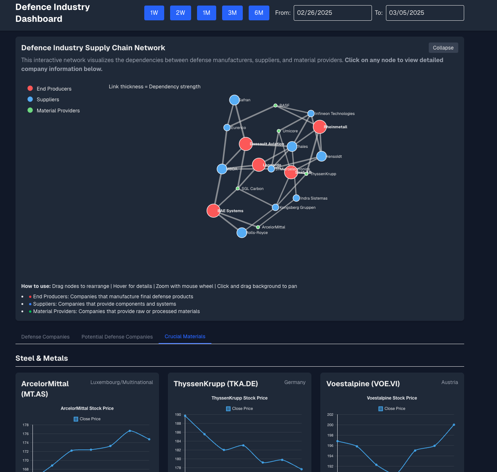

# Defence Industry Dashboard

An interactive dashboard for tracking and analyzing European defense industry companies, their supply chains, and crucial material providers. The dashboard provides visualizations of stock performance and industry relationships.



## Features

- **Interactive Supply Chain Network**: Visualize the dependencies between defense manufacturers, suppliers, and material providers
- **Company Performance Tracking**: Monitor stock performance of defense industry companies
- **Multi-Category Exploration**: Explore defense companies, potential defense companies, and critical material providers
- **Dark/Light Mode Support**: Full theme support for user preference

## Getting Started

First, run the development server:

```bash
npm run dev
```

Open [http://localhost:3000](http://localhost:3000) with your browser to see the result.

## Data Visualization

The dashboard includes several visualizations:

- **Network Graph**: Shows relationships between different companies in the defense supply chain
- **Stock Charts**: Displays stock performance for publicly traded companies
- **Company Cards**: Provides detailed information about each company

## Deployment

This project is deployed on Vercel. You can access the live version at:

[https://eu-defence-dashboard.vercel.app](https://eu-defence-dashboard.vercel.app)

## Technology Stack

- **Framework**: [Next.js](https://nextjs.org)
- **Styling**: [Tailwind CSS](https://tailwindcss.com)
- **Charts**: [Chart.js](https://www.chartjs.com) with React Chart.js
- **Network Visualization**: [D3.js](https://d3js.org)
- **Deployment**: [Vercel](https://vercel.com)

## License

This project is licensed under the MIT License - see the LICENSE file for details.
